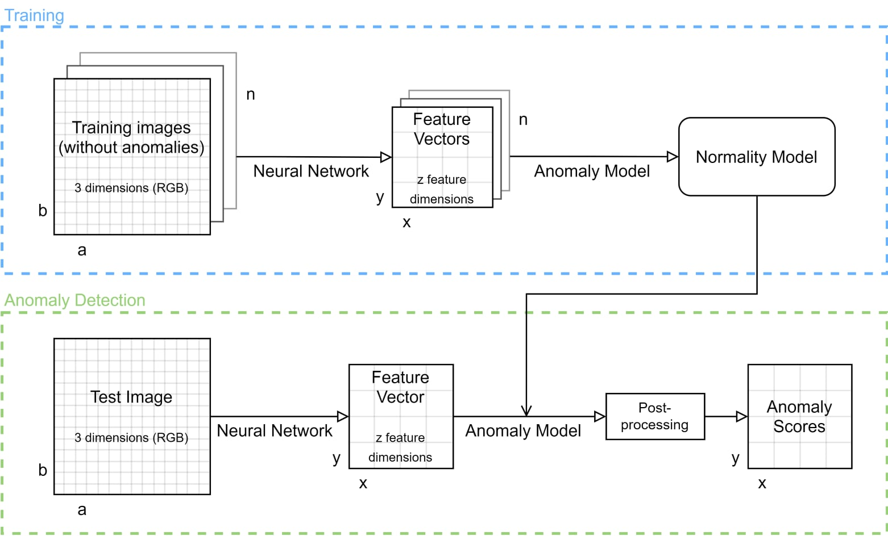

# Vision-based obstacle detection
This repository contains the source code accompanying the Master Thesis of Abhilash Nittur Ramesh with the title "Robust vision-based obstacle detection for factory automation" presented at the Laboratory for Machine Tools and Production Engineering (WZL) at RWTH Aachen University.

The goal is the identification of obstacles in images using a deep hybrid anomaly detection approach in which a deep neural network extracts high level features which are then classified using a conventional classification algorithm.



## Install
```bash
python -m virtualenv .env           # Create virtualenv
source .env/bin/                    # Activate it
pip install -r requirements.txt     # Install the python dependencies

pip install -e .    # Install current directory as editable pip package
```

Requires [TensorFlow 2.1](https://www.tensorflow.org/install) for the feature extraction part.

## Constants
Create a file `./anomaly_detector/consts.py` with the following constants for quick debug excecutions:
```python
# Paths
BASE_PATH      = "/path/to/base"
IMAGES_PATH    = BASE_PATH + "Images/"
EXTRACT_FILES  = IMAGES_PATH + "*.jpg"
EXTRACT_FILES_TEST = BASE_PATH + "Images/Test/*.jpg"
FEATURES_PATH  = BASE_PATH + "Features/"
BENCHMARK_PATH = BASE_PATH + "Benchmark/"
FEATURES_FILE  = FEATURES_PATH + "C3D.h5"
FEATURES_FILES = FEATURES_PATH + "*.h5"
METRICS_PATH   = FEATURES_PATH + "Metrics/"

# Defaults for feature extraction
DEFAULT_BATCH_SIZE = 128
```

## Scripts

### 02_relabel.py
Label images.
```bash
optional arguments:
  -h, --help  show this help message and exit
  --images F  Path to images (default: /path/to/images/from/consts.py/)
```

### 03_extract_features.py
Extract features from images.
```bash
optional arguments:
  -h, --help            show this help message and exit
  --list                List all extractors and exit
  --files [F [F ...]]   File(s) to use (*.jpg)
  --extractor [EXT [EXT ...]]
                        Extractor name. Leave empty for all extractors (default: "")
```

### 04_rasterization_and_models_parallel.sh
Run this instead of 04x_rasterization_and_models.py to utilize multiple CPU cores

### 04x_rasterization_and_models.py
This script calculates
- patch locations
- rasterizations
- models + mahalanobis distances.
These calculations - especially rasterization and mahalanobis distances - are very slow and only seem to use one core. You can call `04_rasterization_and_models_parallel.sh` instead to run multiple instances of this script, which will then utilize more CPU cores. But beware heavy RAM use!

```bash
optional arguments:
  -h, --help           show this help message and exit
  --files [F [F ...]]  The feature file(s). Supports "path/to/*.h5"
  --index I            Used for parallelization (see 04_rasterization_and_models_parallel.sh)
  --total T            Used for parallelization (see 04_rasterization_and_models_parallel.sh)
```

### 05_metrics.py
Calculate metrics for the specified anomaly models.
```bash
optional arguments:
  -h, --help           show this help message and exit
  --files [F [F ...]]  The feature file(s). Supports "path/to/*.h5"
  --output OUT         Output file (default: "")
```

### 06_feature_extractor_benchmark.py
Benchmark the specified feature extractors.
```bash
optional arguments:
  -h, --help            show this help message and exit
  --files F             File(s) to use for benchmarks (*.tfrecord, *.jpg)
  --extractor [EXT [EXT ...]]
                        Extractor name. Leave empty for all extractors (default: "")
  --output OUT          Output file (default: "")
  --batch_sizes [B [B ...]]
                        Batch size for testing batched extraction. (default: [8,16,32,64,128,256,512])
  --init_repeat B       Number of initialization repetitions. (default: 3)
  --extract_single_repeat B
                        Number of single extraction repetitions. (default: 100)
  --extract_batch_repeat B
                        Number of batch extraction repetitions. (default: 10)
```

### 07_rasterization_benchmark.py
Benchmark rasterization for spatial binning.
```bash
optional arguments:
  -h, --help           show this help message and exit
  --files [F [F ...]]  The feature file(s). Supports "path/to/*.h5"
  --output OUT         Output file (default: "")
```

### 08_anomaly_model_benchmark.py
Benchmark the specified anomaly models.
```bash
optional arguments:
  -h, --help           show this help message and exit
  --files [F [F ...]]  The feature file(s). Supports "path/to/*.h5"
  --output OUT         Output file (default: "")
```


